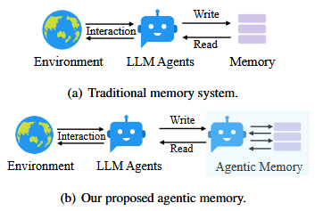
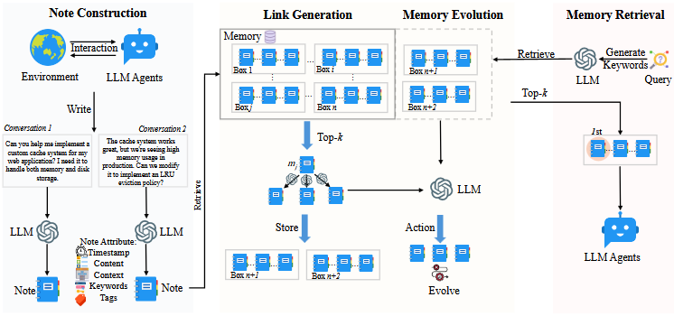
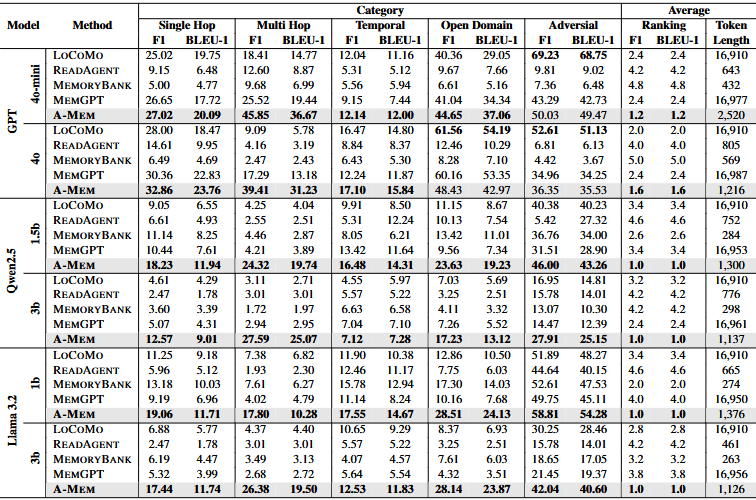
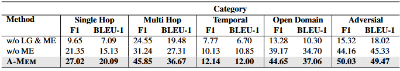
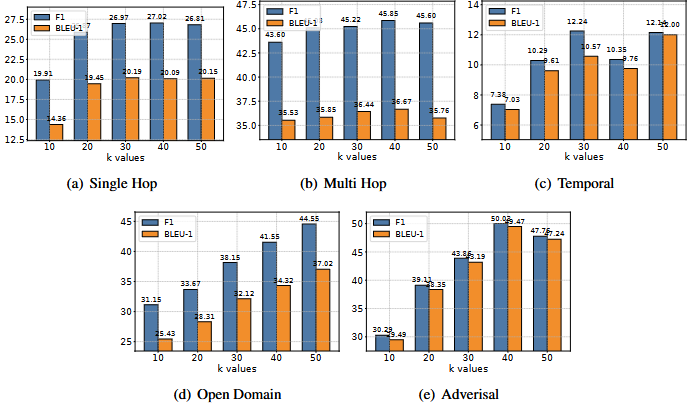
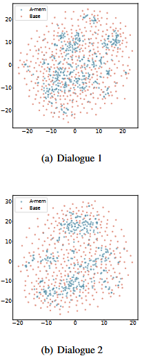
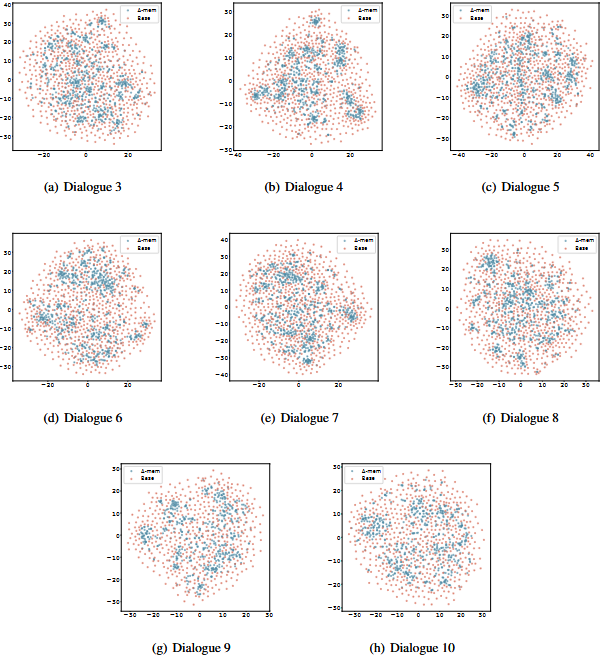

# A-MEM: Agentic Memory for LLM Agents

## Authors
**Wujiang Xu, Zujie Liang, Kai Mei, Hang Gao, Juntao Tan, Yongfeng Zhang**

## Abstract
Large Language Model (LLM) agents require memory to maintain long-term interactions and leverage historical knowledge. However, existing memory systems rely on rigid predefined structures that limit adaptability. To address this, **A-MEM** introduces an **agentic memory system** that dynamically structures and evolves knowledge using principles from the **Zettelkasten method**. This system allows LLM agents to autonomously generate contextual descriptions, establish meaningful memory connections, and evolve stored knowledge dynamically. Empirical results demonstrate significant improvements in memory organization and reasoning capabilities.

---

## 1. Introduction
Traditional memory systems for LLMs require predefined access patterns, which limit flexibility. **A-MEM** enables LLM agents to dynamically organize and evolve memory structures, improving adaptability across tasks.

---

## 2. Related Work
### 2.1 Memory Systems for LLM Agents
Existing systems provide basic storage and retrieval, but they lack flexible organization and evolution capabilities.

### 2.2 Retrieval-Augmented Generation (RAG)
RAG enhances LLMs by retrieving external knowledge. However, **A-MEM** extends this concept by evolving stored memories dynamically.

---

## 3. Methodology
### 3.1 Note Construction
Each new memory note consists of structured attributes, keywords, contextual descriptions, and embedding vectors for similarity matching.

### 3.2 Link Generation
Memory connections are established dynamically based on semantic similarity and shared attributes.

### 3.3 Memory Evolution
New memories refine and update existing ones, allowing continuous adaptation.

### 3.4 Memory Retrieval
Relevant memories are retrieved based on cosine similarity to provide context-aware responses.

---

## 4. Experiments
### 4.1 Dataset and Evaluation
Experiments were conducted on the **LoCoMo** dataset, which includes long-term dialogues requiring complex memory retention.

### 4.2 Baselines
Comparison was made against **LoCoMo, ReadAgent, MemoryBank, and MemGPT**.

### 4.3 Main Results
**A-MEM** consistently outperformed baselines in maintaining structured and relevant memory representations.

---

## 5. Analysis
### 5.1 Ablation Study
Removing the **Link Generation (LG)** or **Memory Evolution (ME)** modules led to performance degradation, confirming their importance.

### 5.2 Hyperparameter Impact
Memory retrieval performance was evaluated with different **k-values**, showing diminishing returns beyond a certain threshold.

### 5.3 Memory Visualization
**t-SNE visualizations** show that **A-MEM** creates well-structured memory clusters compared to baselines.

---

## 6. Conclusion
**A-MEM** introduces an adaptive and self-evolving memory system for LLM agents, allowing long-term structured memory management. The approach significantly improves retrieval accuracy and reasoning efficiency, making it a promising step toward autonomous memory-driven LLM agents.

---

