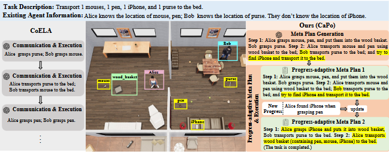
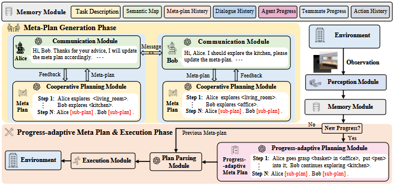
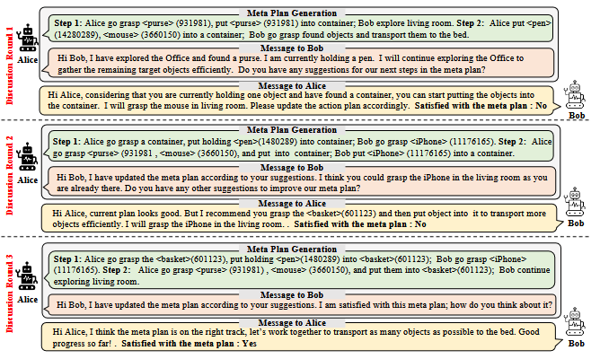
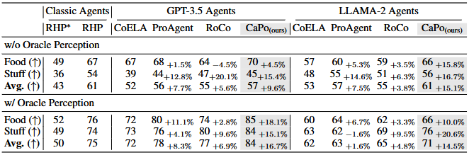
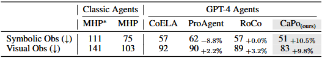
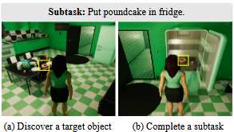
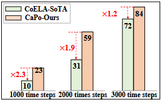
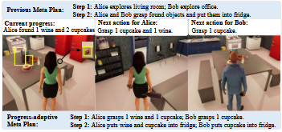

# CAPO: Cooperative Plan Optimization for Efficient Embodied Multi-Agent Cooperation

## Authors
**Jie Liu, Pan Zhou, Yingjun Du, Ah-Hwee Tan, Cees G.M. Snoek, Jan-Jakob Sonke, Efstratios Gavves**

## Abstract
LLM-based embodied agents require effective cooperation to achieve common goals efficiently. However, current approaches lack strategic, long-term planning, leading to redundant steps and failures. This paper introduces **Cooperative Plan Optimization (CaPo)**, which enhances LLM-agent cooperation by integrating:
1. **Meta-Plan Generation**: Agents analyze tasks collaboratively to generate structured plans.
2. **Progress-Adaptive Execution**: Plans are dynamically adjusted based on task progress.

Experiments on the **ThreeDworld Multi-Agent Transport** and **Communicative Watch-And-Help** tasks demonstrate CaPo's superiority in task completion and efficiency.

---

## 1. Introduction
LLM-based agents exhibit strong reasoning and planning capabilities. However, traditional cooperative frameworks focus on short-term planning, leading to inefficiencies. **CaPo** introduces a long-term meta-plan, allowing strategic and adaptive cooperation.

---

## 2. Related Work
### 2.1 LLM-Based Agents
LLM-based agents have been integrated into autonomous decision-making but lack long-term cooperative frameworks.

### 2.2 Multi-Agent Cooperation
Prior methods rely on reactive, step-by-step planning, whereas CaPo optimizes multi-turn discussion and adaptation.

### 2.3 Optimization with LLMs
LLMs have demonstrated optimization potential. CaPo applies these principles to cooperative task execution.

---

## 3. Methodology
### 3.1 Meta-Plan Generation
Agents discuss and generate a **meta-plan** that strategically decomposes the task into subtasks.

### 3.2 Progress-Adaptive Execution
Agents adapt their meta-plan based on new observations, improving efficiency dynamically.

### 3.3 Communication and Task Execution
Agents use structured dialogues to refine and optimize their collaborative plan.

---

## 4. Experiments
### 4.1 Datasets and Evaluation
**Benchmarks:**
- **ThreeDworld Multi-Agent Transport (TDW-MAT)**: Measures object transportation efficiency.
- **Communicative Watch-And-Help (C-WAH)**: Evaluates task completion rates in household settings.

### 4.2 Baselines
Compared against **CoELA, ProAgent, RoCo**, and classical **MCTS-based Hierarchical Planners**.

### 4.3 Main Results
CaPo **outperforms all baselines** in multi-agent coordination tasks.

### 4.4 Ablation Studies
Removing key components of CaPo significantly degrades performance.

### 4.5 Efficiency Analysis
CaPo enhances efficiency in task execution with minimal redundant steps.

---

## 5. Discussion
### 5.1 Cooperation Efficiency
CaPo optimizes long-term planning, reducing unnecessary actions and improving overall agent coordination.

### 5.2 Adaptability to Changing Environments
The dynamic meta-plan allows agents to flexibly adapt to evolving tasks and new discoveries.

---

## 6. Conclusion
CaPo introduces a structured, long-term cooperative framework for LLM-based agents, **improving efficiency, adaptability, and strategic coordination**. Future work will explore scalability in larger multi-agent settings.

---

