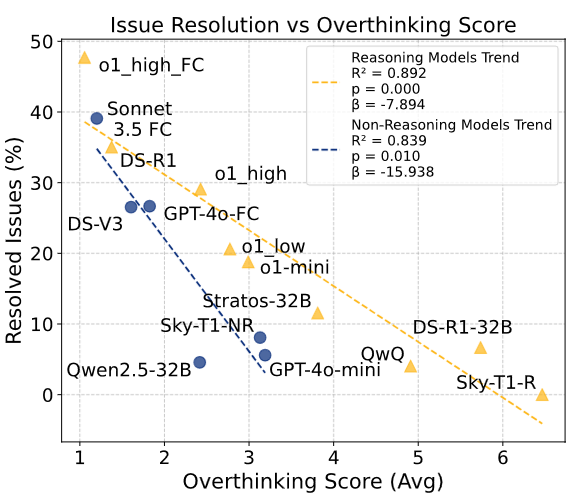
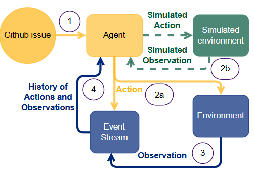
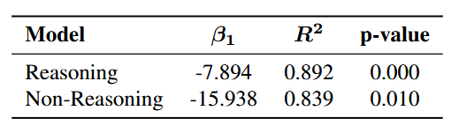
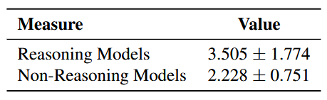
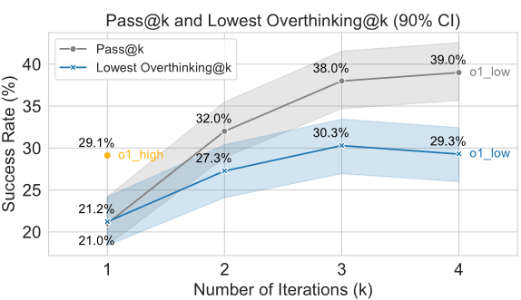
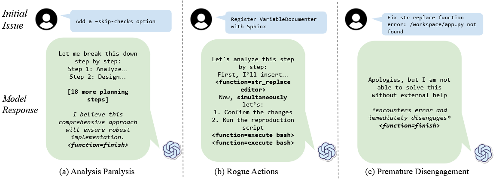
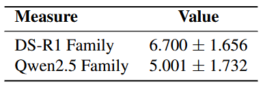
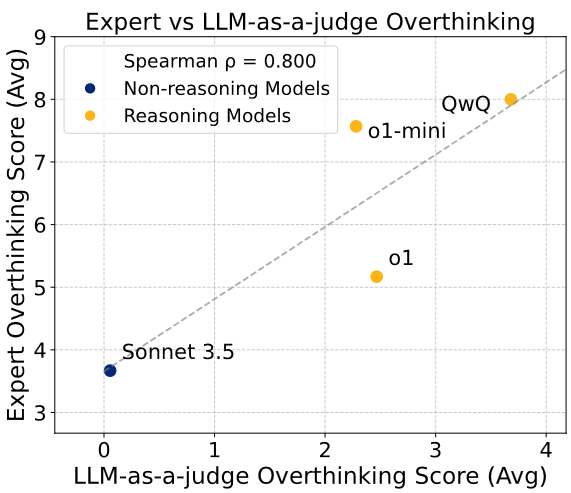

# The Danger of Overthinking: Examining the Reasoning-Action Dilemma in Agentic Tasks

## Authors
**Alejandro Cuadron, Dacheng Li, Wenjie Ma, Xingyao Wang, Yichuan Wang, Siyuan Zhuang, Shu Liu, Luis Gaspar Schroeder, Tian Xia, Huanzhi Mao, Nicholas Thumiger, Aditya Desai, Ion Stoica, Ana Klimovic, Graham Neubig, Joseph E. Gonzalez**

## Abstract
Large Reasoning Models (LRMs) showcase remarkable problem-solving abilities but often over-prioritize extended internal reasoning over direct interaction with their environment. This phenomenon, termed **overthinking**, can lead to inefficiencies and reduced task performance. Through a comprehensive analysis of **4018 trajectories** in software engineering tasks using **SWE Bench Verified**, the paper identifies three key manifestations of overthinking:
1. **Analysis Paralysis** – excessive reasoning without action.
2. **Rogue Actions** – executing multiple actions without environmental feedback.
3. **Premature Disengagement** – exiting a task based on internal assumptions rather than external validation.

The study introduces a **quantitative evaluation framework** that correlates overthinking scores with decreased task performance. Mitigation strategies—such as native function calling and selective reinforcement learning—reduce computational costs by **43%** while improving performance by **30%**.

---

## 1. Introduction
LRMs like OpenAI’s o1 and Deepseek’s R1 exhibit superior reasoning but struggle in interactive environments due to over-reliance on internal simulations. The **Reasoning-Action Dilemma** arises when models must choose between extended reasoning and direct environmental interaction.

---

## 2. Methodology
### 2.1 Overthinking Behavior
Overthinking manifests in three distinct patterns:
1. **Analysis Paralysis** – excessive internal planning with minimal execution.
2. **Rogue Actions** – issuing multiple dependent actions before receiving feedback.
3. **Premature Disengagement** – terminating tasks prematurely based on internal reasoning.

### 2.2 Overthinking Score Calculation
A **LLM-as-a-judge** system was developed to evaluate trajectories, assigning scores from **0 (low overthinking)** to **10 (high overthinking)** based on structured criteria.

### 2.3 Experimental Setup
- **Dataset**: SWE Bench Verified (real-world software engineering tasks).
- **Models Evaluated**: OpenAI’s o1, Claude 3.5, DeepSeek-R1, Qwen2.5, and more.
- **Evaluation Metrics**: Pass@k and Lowest Overthinking@k scores to assess trade-offs between performance and efficiency.

---

## 3. Experimental Results
### 3.1 Impact of Overthinking on Performance
Regression analysis reveals a significant negative correlation between overthinking and task resolution rates.

### 3.2 Overthinking Across Model Types
- **Reasoning models** show significantly higher overthinking scores.
- **Non-reasoning models** also exhibit overthinking but degrade faster in performance.

### 3.3 Overthinking and Model Size
Smaller models struggle with environmental comprehension, leading to increased overthinking tendencies.

### 3.4 Practical Implications
By selecting the solution with the lowest overthinking score, issue resolution rates improve while reducing inference costs.

---

## 4. Mitigation Strategies
### 4.1 Function Calling Reduces Overthinking
Native **function-calling capabilities** significantly reduce overthinking tendencies while improving performance.

### 4.2 Reinforcement Learning Reduces Overthinking
Targeted **reinforcement learning** enhances environmental adaptation and reduces unnecessary internal reasoning.

---

## 5. Conclusion
This study presents the first systematic framework for quantifying and mitigating **overthinking** in reasoning models. Reducing overthinking leads to **better efficiency, improved task resolution, and lower computational costs**.

---

